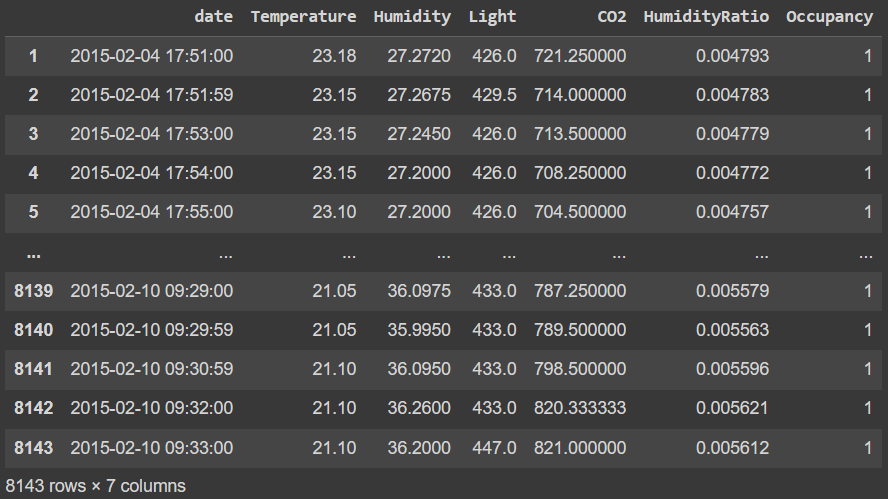
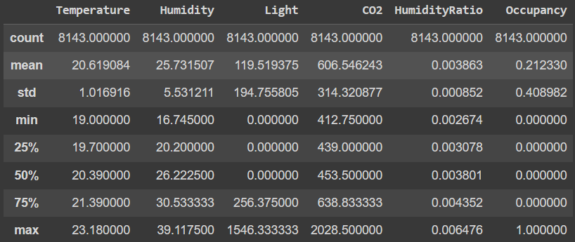
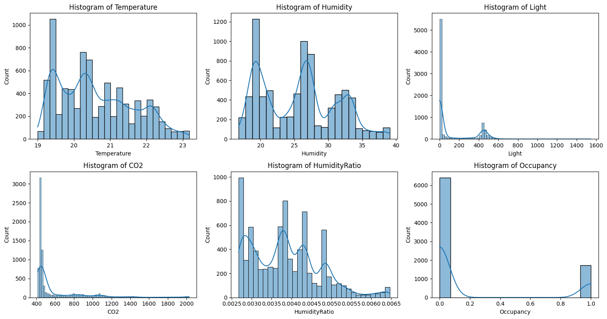
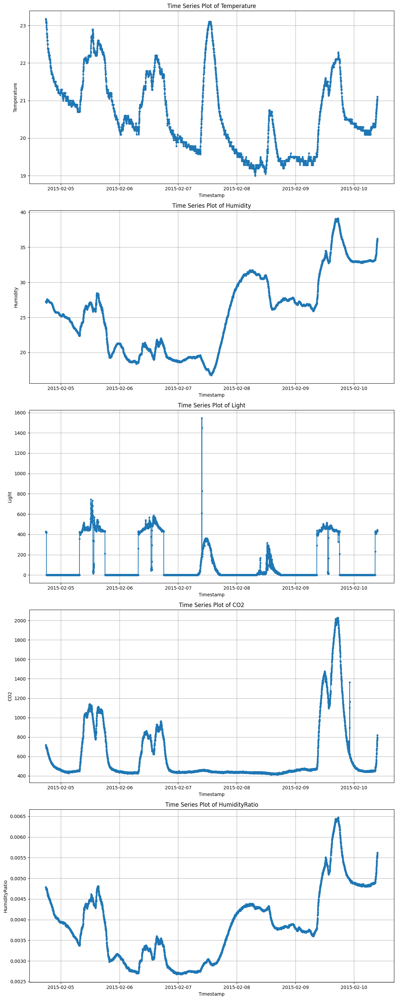
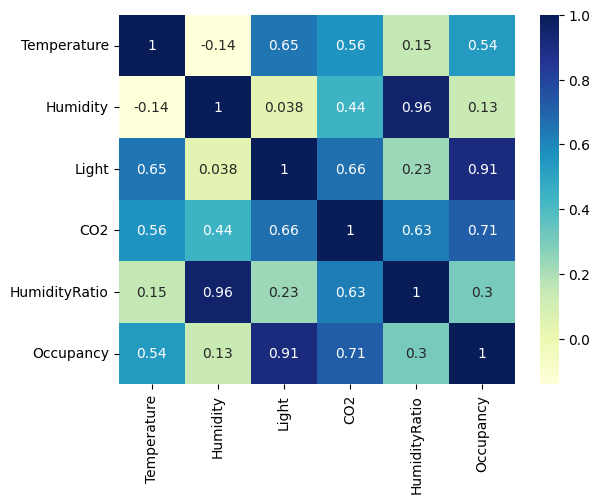
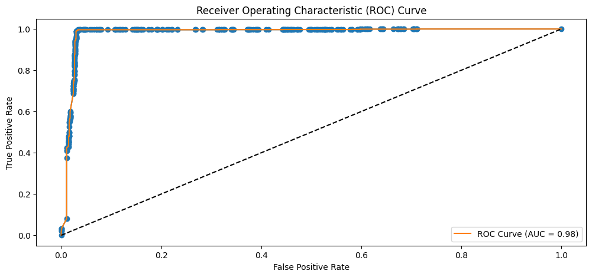

# Room_Occupancy_Detection
This project involves analyzing sensor data from various sensors placed in a room. These sensors include motion detectors, temperature sensors, light sensors, and even sound sensors. The objective is to develop a machine-learning model that can classify whether the room is currently occupied or unoccupied based on the sensor readings. This is a binary classification task where the model predicts one of two classes: "occupied" or "unoccupied."

## Data Description
The data is of secondary source and is taken from
Candanedo,Luis. (2016). Occupancy Detection . UCI Machine Learning Repository.  https://doi.org/10.24432/C5X01N.

It is an experimental, multivariate, time-series data.  
It has 20560 instances and 7 attributes, including the target.  
The data is divided into 3 sets one for training, testing, and validation. Ground-truth occupancy was obtained from time-stamped pictures that were taken every minute.
It has no missing values.

### Attribute Information
date time year-month-day hour:minute:second  
Temperature, in Celsius  
Relative Humidity, in percentage  
Light, in Lux  
CO2, in ppm  
Humidity Ratio, Derived quantity from temperature and relative humidity, in kgwater-vapor/kg-air  
Occupancy, 0 or 1, 0 for not occupied, 1 for occupied status 

## Business Objectives
1. **Energy Efficiency:** Predicting room occupancy can be essential for optimizing energy consumption in buildings. By knowing when a room is unoccupied, heating, cooling, and lighting systems can be adjusted or turned off, leading to significant energy savings.
2. **Security and Safety:** Knowing if a room is occupied is important for security and safety purposes. In a smart home or office environment, this information can be used to trigger security systems or alerts when unauthorized access is detected.
3. **Resource Optimization:** Predicting occupancy helps in resource allocation. For example, in a hotel, the cleaning staff can be directed to rooms that are vacant, reducing labor costs and minimizing disturbance to guests.
4. **Occupancy Insights:** Beyond energy efficiency and security, occupancy data can provide valuable insights into space utilization. Organizations can use this information to optimize office layouts or to plan for future space requirements.

# Methadology
### Data Preprocessing and EDA
To begin with I tried to get a basic understanding of the data.  
Here is an overview of the train set with its summary statistics.
   
   

I plotted histograms and time-series graphs.  
   
   

There were no missing or duplicate values.  
I used Min-Max Scaler to normalize the data. The target column was imbalanced so I used SMOTE to fix the issue. 

I then used a heatmap and found out there is a strong correlation between Light and Occupancy. CO2 level also has a high correlation with Occupancy.  
   
Humidity and HumidityRatio have a high correlation with each other, leading to multicollinearity. So to avoid this I dropped the Humidity column.

### Feature Engineering
So for feature engineering, I just dropped the date and Humidity column.

### Modelling
For this project, I used 4 models
1. Logistic Regression
2. Decision Tree Classifier 
3. Random Forest Classifier 
4. Ada Boost Classifier

Out of which 
Random Forest Classifier
 gave the best score. After Hyperparameter tuning, it gave a score of ==98.02%==  
Other performance metrics are as follows : 

**Accuracy:** The accuracy of ==97.69%== indicates that the overall model performance is relatively high. It suggests that the model correctly predicts the outcome for approximately 97.69% of the cases. 

**Specificity:** The specificity of ==95.74%== suggests that the model performs well in correctly identifying negative cases. Specifically, it indicates that the model correctly classifies about 95.74% of the true negatives. 

**Sensitivity:** The sensitivity (also known as recall or true positive rate) of ==99.64%== suggests that the model is effective at identifying positive cases. It indicates that the model correctly identifies approximately 99.64% of the true positives. 

**F1 score:** The F1 score of ==97.74%== is a measure that combines precision and recall (sensitivity) into a single metric. It is useful when you want to balance both false positives and false negatives. The F1 score of 97.74% suggests that the model has a good trade-off between precision and recall, providing a balanced performance.

Finally here is what the ROC looks like.

# Conclusion
In conclusion, a machine learning project for predicting room occupancy based on sensor data has practical applications across various sectors, including building management, security, energy conservation, and user comfort. It addresses real-world problems and can lead to cost savings, improved resource allocation, and enhanced user experiences while also presenting challenges related to data quality, privacy, and real-time processing.
